  

  

  
  
  

  

  

### 💫 About Me

I am a passionate **Artificial Intelligence** engineering student specializing in building smart agents, computer vision pipelines, and deep learning architectures. With a strong theoretical foundation and hands-on research and industry-relevant internship experience, I enjoy working at the intersection of AI, Robotics, and Data Science.

- 🎓 **Education**: Pursuing **Bachelor of Technology in Artificial Intelligence** at **Amity University** (Noida, India) with a current grade of **7.68 CGPA** (Expected graduation: 2026).
- 🔬 **Research Experience**: Completed a prestigious international **Research Internship** at **Eastern International University (EIU), Vietnam**, developing self-driving and navigation algorithms.
- 📝 **Publications**: Published an IEEE-indexed research paper on agentic business intelligence workflows (**CHIMERA**).
- 🧠 **Focus Areas**: Deep Learning, Computer Vision, Multi-Agent Systems, Natural Language Processing, and Autonomous Robotics.
- 🌱 **Current Pursuits**: Diving deep into Multi-Modal Models, LLM fine-tuning, and advanced robot kinematics (ROS).

### 🛠️ Tech Stack & Skills

  

### 🔬 Research & Professional Experience

💼 **Research Intern** – *Eastern International University (EIU), Vietnam* *(May 2025 – Jul 2025)*
- **Self-Driving Algorithms**: Designed and implemented self-driving control algorithms for autonomous mobile robots.
- **Visual Odometry**: Built a highly efficient ORB-based feature extraction and matching pipeline for real-time robotic pose estimation.
- **Hardware Integration**: Successfully integrated Intel RealSense D435 RGB-D depth sensors with Python and C++ on Ubuntu.
- **Benchmarking**: Rigorously evaluated trajectory tracking and odometry performance on standard datasets including EuRoC MAV and TUM VI.

### 📝 Publications

📄 **CHIMERA: An Agent-Based Business Intelligence Framework** *(EPDMC 2026 / IEEE Xplore)*
- Published a first-author paper focused on AI-driven automated analytics. The framework uses LLM-based conversational intelligence, LangChain, and multi-agent workflows to automate complex business intelligence data pipelines.
- *M. Sethi, A. Goel and S. Ratna, "CHIMERA: An Agent-Based Business Intelligence Framework," 2026 1st International Electronics & Packaging Technologies Conference (EPT India).*
- 🔗 **IEEE Xplore link**: [Access Paper](https://ieeexplore.ieee.org/document/11496374)

### 🚀 Highlighted Projects

*   🔮 **CHIMERA: Agentic BI Framework** *(Sep 2025 – Nov 2025)*
    *   Designed a multi-agent system coordinating tasks for end-to-end data preprocessing, SQL query generation, data analysis, and report visualisations.
    *   Leveraged **LangChain** and **Mistral-7B** to create a conversational interface allowing non-technical users to run complex database analytics.
    *   Automated charting and dashboard generation, increasing analytical workflow efficiency by over 40%.
*   🤖 **Autonomous Mobile Robot Navigation (Visual Odometry)** *(May 2025 – Jul 2025)*
    *   Built a real-time visual odometry navigation stack using monocular camera feeds.
    *   Programmed an ORB-based feature extraction and descriptor matching pipeline in **C++** and **Python** utilizing **OpenCV** and **ROS**.
    *   Demonstrated robust trajectory estimation with low drift rate against high-accuracy ground truths from EuRoC MAV datasets.
*   📈 **Website Traffic Forecasting (LSTM + GRU Fusion)** *(May 2023 – Jul 2023)*
    *   Engineered a hybrid recurrent neural network combining LSTM and GRU units to forecast highly volatile web traffic.
    *   Extracted key temporal features (day of week, seasonality, holidays) and trained the network using TensorFlow, achieving superior prediction accuracy over standard ARIMA baselines.
*   🎗️ **Breast Cancer Detection using CNN** *(Jul 2024 – Sep 2024)*
    *   Developed a Convolutional Neural Network (CNN) in **Keras/TensorFlow** to classify histopathological images.
    *   Implemented data augmentation techniques (rotation, zoom, flips) and fine-tuned hyperparameters to mitigate overfitting, achieving a peak validation accuracy of **98%**.

### 🏆 Achievements & Certifications

*   🏅 **Ericsson Edge Academia Program**: Ranked among the **Top 500 students** nationwide.
*   📜 **Python for Data Science**: NPTEL Certification (Nov 2024)
*   📜 **Probability Theory for Data Science**: NPTEL Certification (May 2025)
*   👥 **Content Head & Founding Member** – *Srijan Society* *(Oct 2023 – Jul 2024)*: Led creative content strategy, digital branding, and organized community-building student workshops.

### 📊 GitHub Activity & Stats

  
  

  

  

  ⭐️ From <a href="https://github.com/Muskan6376567236">Muskan6376567236</a>

<!-- Rendered with love -->
